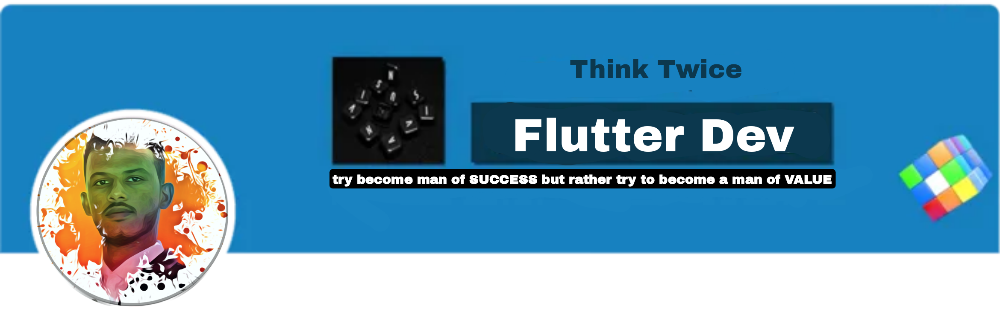

<h2> السلام عليكم , I'm Qusai Alsimat! </h2>





<p><em> Flutter Developer</<a href="/">
</a>
</em></p>

[](https://twitter.com/intent/follow?screen_name=misteranmol)
[](https://www.linkedin.com/in/qusaizmm)

[](https://no/)


### 📫 Like to meet me?

Pick a slot if you'd like to meet me and chat about anything you are passionate about - but make sure to describe the agenda

<a href="https://calendly.com/qusaizzm/30min" target="_blank"></a>


###  A little more about me...  

```
const Qusai = {
    pronouns: "He" | "Him",
    code: ["Dart", "Javascript", "C#", "PHP"],
    askMeAbout: ["Flutter dev", "web dev", "tech", "photography"],
    technologies: {
        backEnd: {
            fw: ["Node", "Laravel", ".Net", "Express"],
        },
        mobileApp: {
            native: ["Flutter Development"]
        },
        devOps: ["AWS"],
        databases: ["mongo", "MySql", "sqlite", "SQL Server"],
        misc: ["Firebase", "Socket.IO"]
    },
    architecture: ["Serverless Architecture", "Progressive web applications", "Single page applications"],
    currentFocus: "life",
    funFact: "There are two ways to write error-free programs; only the third one works"
};
```

- 🔭 I’m currently working on **Social Media SMM Application**
- 🌱 I’m currently learning **React**
- 💬 Ask me about **Flutter, SQL, PHP, Firebase, API,**
- 📫 How to reach me **qusaise188@gmail.com**

---
<!--START_SECTION:waka-->


**🐱 My GitHub Data** 

> 📦 182.8 kB Used in GitHub's Storage 
 > 
> 🏆 96 Contributions in the Year 2023
 > 
> 🚫 Not Opted to Hire
 > 
> 📜 21 Public Repositories 
 > 
> 🔑 23 Private Repositories 
 > 
**I'm an Early 🐤** 

```text
🌞 Morning                596 commits         ███░░░░░░░░░░░░░░░░░░░░░░   12.56 % 
🌆 Daytime                1795 commits        █████████░░░░░░░░░░░░░░░░   37.84 % 
🌃 Evening                1512 commits        ████████░░░░░░░░░░░░░░░░░   31.87 % 
🌙 Night                  841 commits         ████░░░░░░░░░░░░░░░░░░░░░   17.73 % 
```
📅 **I'm Most Productive on Sunday** 

```text
Monday                   557 commits         ███░░░░░░░░░░░░░░░░░░░░░░   11.74 % 
Tuesday                  585 commits         ███░░░░░░░░░░░░░░░░░░░░░░   12.33 % 
Wednesday                804 commits         ████░░░░░░░░░░░░░░░░░░░░░   16.95 % 
Thursday                 591 commits         ███░░░░░░░░░░░░░░░░░░░░░░   12.46 % 
Friday                   533 commits         ███░░░░░░░░░░░░░░░░░░░░░░   11.24 % 
Saturday                 672 commits         ████░░░░░░░░░░░░░░░░░░░░░   14.17 % 
Sunday                   1002 commits        █████░░░░░░░░░░░░░░░░░░░░   21.12 % 
```


📊 **This Week I Spent My Time On** 

```text

💬 Programming Languages: 
No Activity Tracked This Week

🔥 Editors: 
No Activity Tracked This Week

💻 Operating System: 
No Activity Tracked This Week
```


<h3 align="left">Languages and Tools:</h3>
<p align="left"> <a href="https://developer.android.com" target="_blank" rel="noreferrer">  </a> <a href="https://getbootstrap.com" target="_blank" rel="noreferrer">  </a> <a href="https://www.w3schools.com/cs/" target="_blank" rel="noreferrer">  </a> <a href="https://www.w3schools.com/css/" target="_blank" rel="noreferrer">  </a> <a href="https://dart.dev" target="_blank" rel="noreferrer">  </a> <a href="https://dotnet.microsoft.com/" target="_blank" rel="noreferrer">  </a> <a href="https://expressjs.com" target="_blank" rel="noreferrer">  </a> <a href="https://firebase.google.com/" target="_blank" rel="noreferrer">  </a> <a href="https://flutter.dev" target="_blank" rel="noreferrer">  </a> <a href="https://www.framer.com/" target="_blank" rel="noreferrer">  </a> <a href="https://www.w3.org/html/" target="_blank" rel="noreferrer">  </a> <a href="https://www.adobe.com/in/products/illustrator.html" target="_blank" rel="noreferrer">  </a> <a href="https://kotlinlang.org" target="_blank" rel="noreferrer">  </a> <a href="https://www.mongodb.com/" target="_blank" rel="noreferrer">  </a> <a href="https://www.microsoft.com/en-us/sql-server" target="_blank" rel="noreferrer">  </a> <a href="https://www.mysql.com/" target="_blank" rel="noreferrer">  </a> <a href="https://nodejs.org" target="_blank" rel="noreferrer">  </a> <a href="https://www.photoshop.com/en" target="_blank" rel="noreferrer">  </a> <a href="https://www.php.net" target="_blank" rel="noreferrer">  </a> <a href="https://postman.com" target="_blank" rel="noreferrer">  </a> <a href="https://www.adobe.com/products/xd.html" target="_blank" rel="noreferrer">  </a> </p>

<p></p>


 <em><b>I love connecting with different people</b> so if you want to say <b>hi, I'll be happy to meet you more!</b> 😊</em>

 Last Updated on 14/07/2023 00:29:56 UTC
<!--END_SECTION:waka-->
